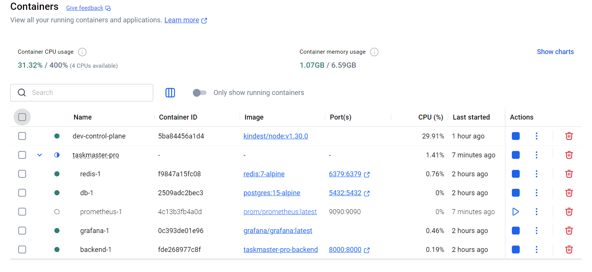
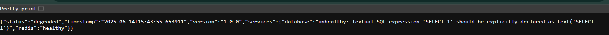
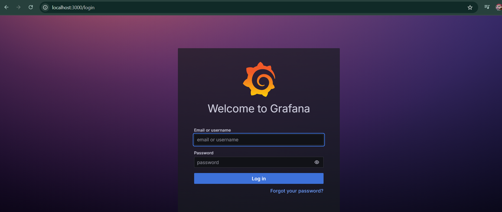
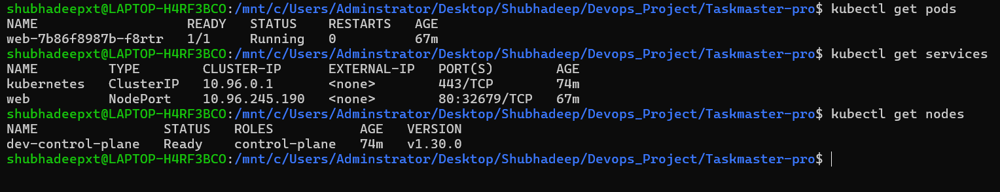
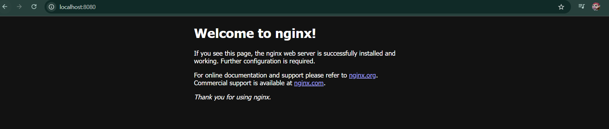

# Day 2: Docker Desktop + Kubernetes Setup

## 🎯 Goals Achieved
- ✅ Docker Desktop + WSL 2 integration working
- ✅ Multi-container stack with docker-compose
- ✅ Kind cluster created and running
- ✅ Kubernetes deployment tested with Nginx
- ✅ Port forwarding working

## 🐳 Docker Stack
- **Backend**: FastAPI running on port 8000
- **Frontend**: Node.js + Express on port 3000
- **Database**: PostgreSQL on port 5432
- **Cache**: Redis on port 6379
- **Monitoring**: Prometheus + Grafana

## ☸️ Kubernetes Progress
- **Cluster**: Kind cluster named "dev"
- **Test Deploy**: Nginx deployment successful
- **Networking**: Port forwarding 8080:80 working
- **Status**: Ready for TaskMaster deployment

## 📸 Screenshots

## 🚀 Next Steps (Day 3)
- Deploy TaskMaster backend to Kubernetes
- Configure PostgreSQL in Kubernetes
- Set up proper service networking
- Implement Helm charts
