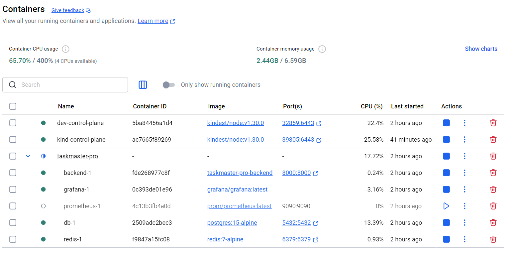
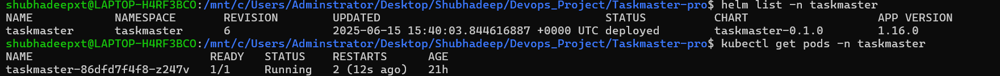
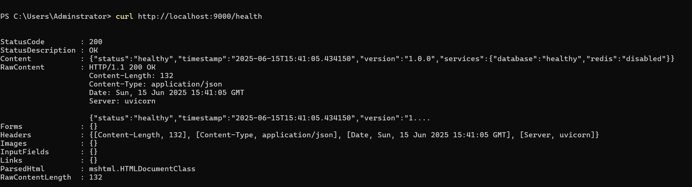

# Day 3: Helm Chart Bootstrap & First In-Cluster Deploy

## 🎯 Goals Achieved
- ✅ Helm v3 installed in WSL 2
- ✅ Chart scaffolded (`helm create taskmaster`)
- ✅ Image + port values updated (`taskmaster-backend:kind`, **8000**)
- ✅ Chart deployed to **kind** in namespace `taskmaster`
- ✅ Pod healthy with SQLite fallback (`/health → {"status":"healthy"}`)
- ✅ Helm upgrade cycle verified (revision 6)

## 🐳 Docker / Local Stack (unchanged)
| Service | Image | Host Port |
|---------|-------|-----------|
| FastAPI backend | `taskmaster-pro-backend:latest` (compose) / `taskmaster-backend:kind` (kind) | 8000 |
| Frontend (future) | `taskmaster:dev` | 3000 |
| PostgreSQL | `postgres:15-alpine` | 5432 |
| Redis | `redis:7-alpine` | 6379 |
| Prometheus | `prom/prometheus:latest` | 9090 |
| Grafana | `grafana/grafana:latest` | 3000 |

## ☸️ Kubernetes Progress
| Item | Result |
|------|--------|
| **Cluster** | `kind-dev` (control-plane ready) |
| **Helm release** | `taskmaster` v6 → 1 Pod Running / 1 replica |
| **Service** | ClusterIP on port 8000, port-forward **9000:8000** works |
| **Env vars** | `DATABASE_URL=sqlite:///./test.db`, `REDIS_URL=redis://localhost` |
| **Health** | `curl http://localhost:9000/health` → 200 OK, JSON healthy |
| **Old RS crash** | Left intentionally as demo of rollout history; scaled down |

## 📸 Screenshots

 