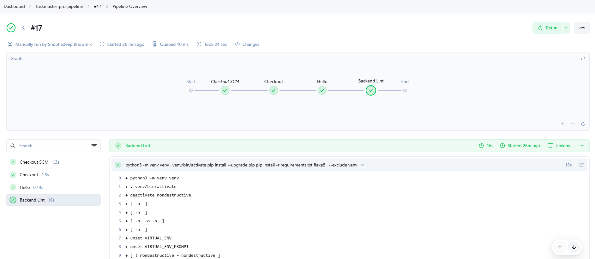
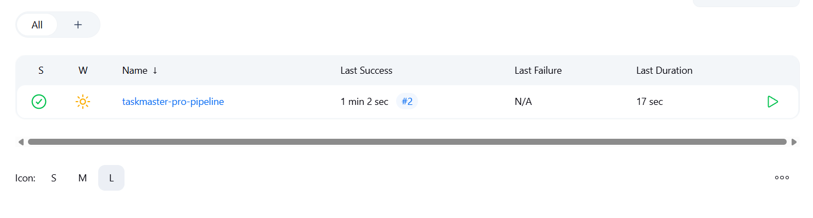

# Day 5: CI/CD Pipeline Foundation (Jenkins & Linting)

## 🎯 Goals Achieved
- ✅ Jenkins set up in Docker and connected to GitHub repo
- ✅ Jenkins pipeline job created and configured
- ✅ Jenkinsfile added to repo and pipeline runs on push
- ✅ Backend linting (flake8) integrated as a pipeline stage
- ✅ All flake8 errors in backend/main.py fixed
- ✅ Jenkins pipeline now passes with clean code

## ⚙️ CI/CD Progress
| Stage         | Status      | Notes |
|---------------|------------|-------|
| Jenkins Setup | ✅ Complete | Running in Docker, plugins installed |
| GitHub SCM    | ✅ Complete | Pipeline pulls code from repo |
| Linting       | ✅ Complete | Flake8 for backend, enforced in CI |
| Testing       | ✅ Pending  | To be added (pytest) |
| Docker Build  | ✅ Pending  | To be added |
| Deployment    | ⬜ Pending  | To be added (Helm/K8s) |

## 🐞 Troubleshooting & Lessons
- Jenkins agent lacked Python/pip; fixed by installing in container
- PEP 668 error (externally managed Python); solved with venv in Jenkinsfile
- Jenkins slow due to low Docker resources; fixed by increasing RAM/CPU
- Flake8 errors required multiple rounds of code cleanup (long lines, unused imports, indentation)
- Incremental, testable changes made troubleshooting easier

## 🚀 Next Steps (Day 6+)
- Add backend tests (pytest) to pipeline
- Add Docker build and push stages
- Implement deployment to Kubernetes (Helm)
- Document each CI/CD step and update screenshots

## 📸 Screenshots

<!-- Newly added screenshots for Day 5 -->

## Jenkins CI/CD Checkpoint (June 2024)

- Jenkins pipeline is now fully implemented and passing all stages.
- Screenshots of the pipeline and key steps have been taken for documentation/portfolio.
- Next focus: deployment (Kubernetes/Helm), then interview Q&A.
- Ongoing plan: continue enhancing with new tools and features.

--- 